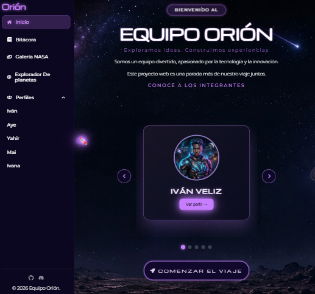
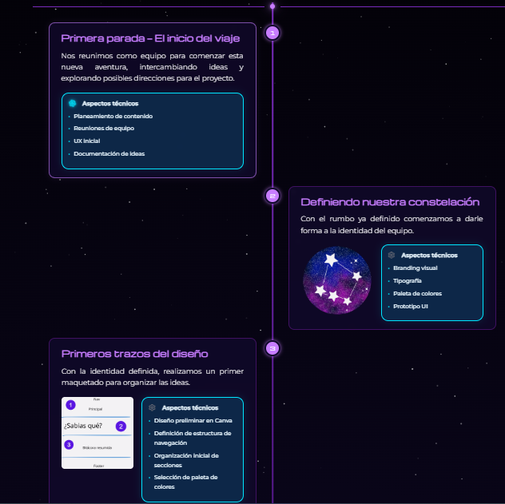
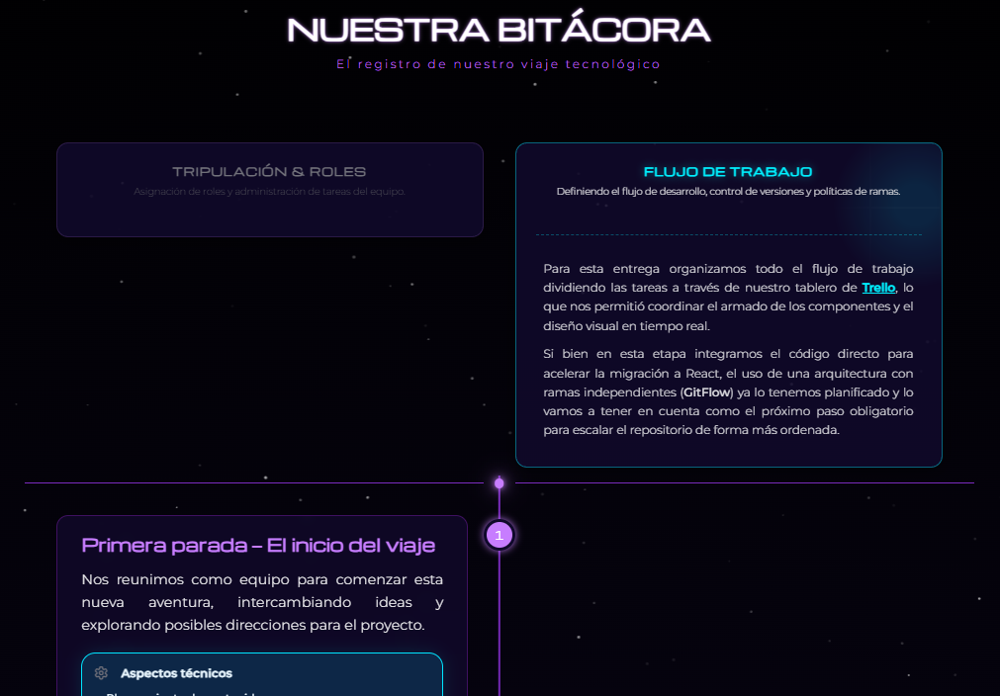
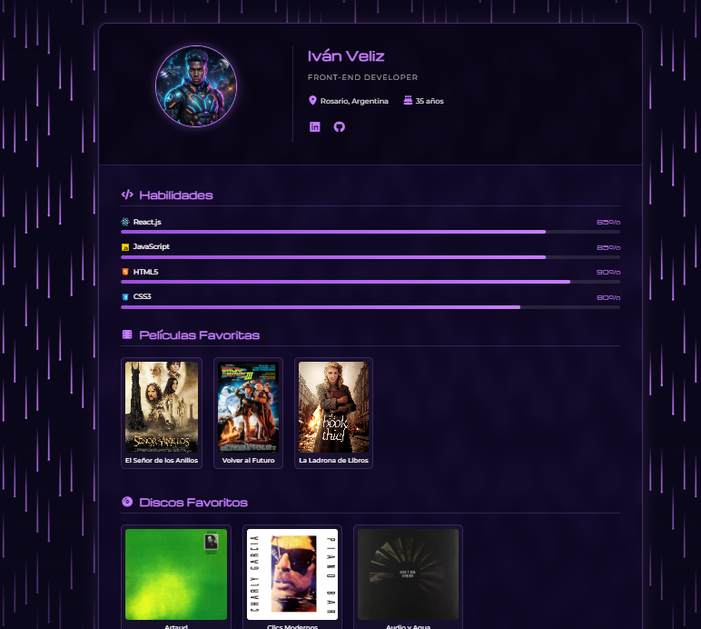
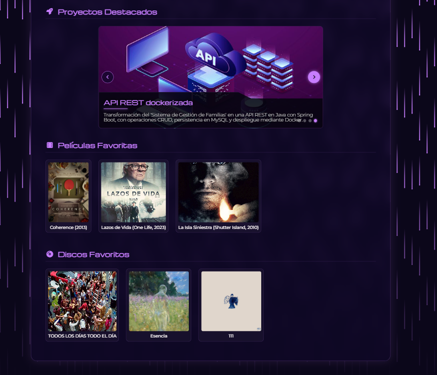
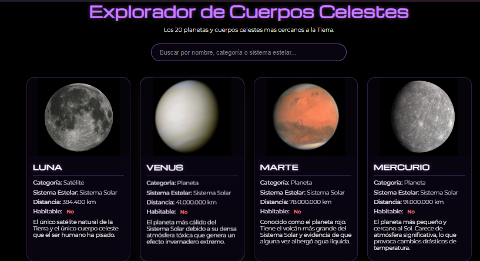
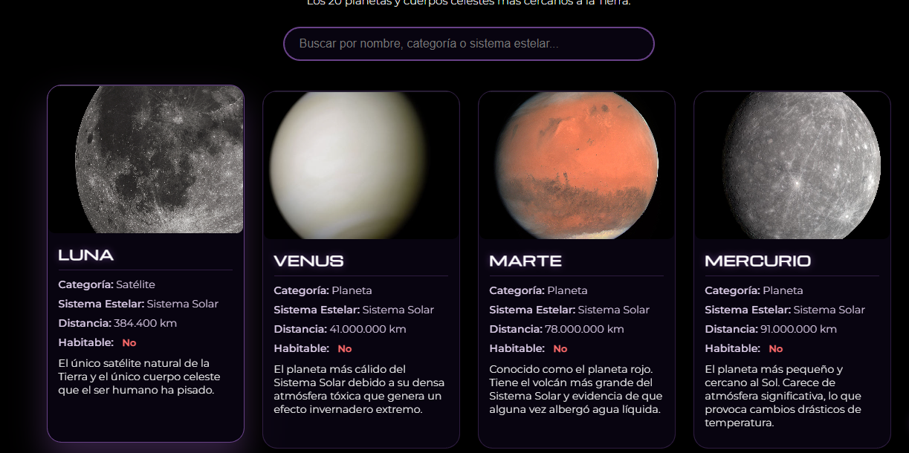
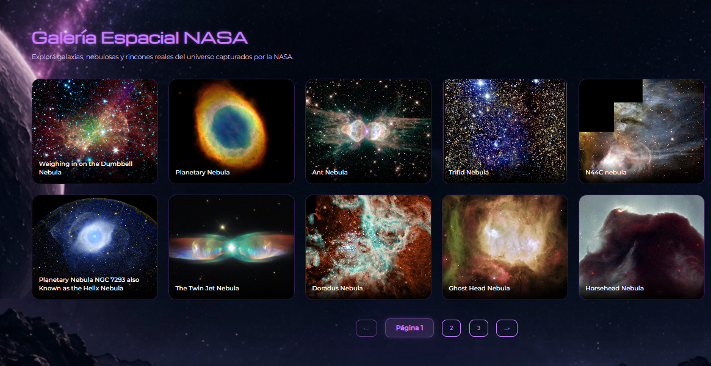

# Equipo Orión - Proyecto Web

## Descripción

Aplicación web de presentación y bitácora del Equipo Orión, desarrollada en React con Vite como trabajo práctico para la Tecnicatura en Desarrollo de Software.

El sitio combina una estética espacial con colores oscuros, tipografías modernas, animaciones suaves y secciones interactivas para mostrar la identidad del equipo, nuestra bitácora de desarrollo, una galería NASA y perfiles de integrantes.


## Objetivos del proyecto

- Mostrar la identidad del equipo en una experiencia visual moderna.
- Documentar el proceso del desarrollo con una bitácora cronológica.
- Incluir animaciones e interactividad manteniendo diseño responsive.
- Aprovechar tecnologías web modernas para una aplicación SPA.

## Cambios recientes

- Se creó `src/data/bitacoraData.js` — los 12 hitos de la bitácora están ahora en un archivo de datos y se renderizan dinámicamente desde `src/pages/Bitacora/Bitacora.jsx`.
- La bitácora fue refactorizada para mapear los hitos con `.map()` y alternar la posición (`hito-izq` / `hito-der`) según el índice.
- Se reemplazó el lightbox personalizado por `yet-another-react-lightbox` con el plugin `Zoom` para una experiencia de visualización mejorada.
- Se mantienen las animaciones con `Framer Motion`, el fondo de partículas (tsParticles) y los estados interactivos de las tarjetas.

## Integrantes del equipo

- **Iván** — [GitHub](https://github.com/Ivanveliz)
- **Maira** — [GitHub](https://github.com/MaiiMd)
- **Ivana** — [GitHub](https://github.com/IvanaZandona)
- **Ayelén** — [GitHub](https://github.com/mariaayelen)
- **Yahir** — [GitHub](https://github.com/yahirperez2899-dotcom)

## Tecnologías utilizadas

- **React**: Biblioteca principal para construir la UI.
- **Vite**: Herramienta de build y desarrollo rápido.
- **React Router DOM**: Enrutamiento interno de la app.
- **Framer Motion**: Animaciones de aparición y transiciones.
- **tsParticles**: Fondo de partículas animadas.
- **Font Awesome**: Íconos de navegación y UI.
- **Yet Another React Lightbox**: Lightbox para la galería de imágenes.
- **React Icons**: Iconos de interfaz.

## Estructura principal del proyecto

```bash
src/
├── App.jsx
├── main.jsx
├── components/
│   ├── Footer/
│   ├── HeroSection/
│   ├── Loader/
│   ├── NasaGallery/
│   ├── Particles/
│   ├── Perfiles/
│   ├── ProfileCard/
│   ├── ProjectCarousel/
│   ├── ScrollTopBtn/
 │   ├── Sidebar/
 │   └── TeamCard/
├── data/
│   ├── dataPlanet.json
│   ├── teamData.js
│   └── bitacoraData.js
├── hooks/
│   └── useRocketCursor.js
├── layouts/
│   └── DashboardLayout.jsx
├── pages/
│   ├── Bitacora/
│   │   └── Bitacora.jsx
│   ├── DataExplorer.jsx
│   ├── Galeria.jsx
│   └── Home.jsx
├── services/
│   └── nasaApi.js
└── styles/
    └── global.css
```

## Árbol de Renderizado (Render Tree)

A continuación se presenta la representación gráfica de la estructura jerárquica de componentes de la aplicación. Se identifica claramente el componente raíz (`App`), el layout superior de navegación y cómo se desglosan los componentes hijos principales:

```text
App (Componente Raíz)
 └── BrowserRouter (Contexto de Enrutamiento)
      └── Routes
           └── Route (DashboardLayout - Nivel Superior)
                ├── Sidebar (Navegación lateral dinámica)
                └── Outlet (Contenedor dinámico de páginas)
                     │
                     ├── Home (Página Principal)
                     │    ├── useRocketCursor (Hook Custom)
                     │    ├── HeroSection (Cabecera y título)
                     │    └── TeamCarousel (Carrusel de integrantes)
                     │         └── TeamCard (Tarjeta interactiva con ruteo)
                     │
                     ├── Bitacora (Página de Progreso)
                     │    └── Tarjetas de hitos cronológicos (Framer Motion)
                     │
                     ├── Galeria (Página de Galería NASA)
                     │    └── NasaGallery (Grilla de imágenes APOD)
                     │         └── Loader (Spinner de carga)
                     │
                     ├── Perfiles (Página de Detalle de Tripulante)
                     │    └── ProfileCard (Layout de información)
                     │         ├── SkillProgressBar (Barras animadas)
                     │         └── ProjectCarousel (Carrusel de proyectos personales)
                     │
                     └── DataExplorer (Página Explorador Espacial)
                          └── Resultados de búsqueda (Tarjetas con Hover Cinemático)
```

## Rutas principales

- `/` — Página de inicio con hero y carrusel de integrantes.
- `/bitacora` — Bitácora de desarrollo con timeline y hitos.
- `/galeria` — Galería espacial que consume imágenes de la NASA.
- `/explorador` — Explorador de cuerpos celestes con búsqueda y filtros.
- `/perfiles/:id` — Perfil individual de cada integrante.

## Contenido clave

### `src/pages/Home.jsx`
- Página de inicio con la sección principal y el carrusel del equipo.
- Incluye el efecto de cursor cohete con `useRocketCursor`.

### `src/pages/Bitacora/Bitacora.jsx`
- Bitácora visual con hitos del proyecto.
- Tarjetas expansibles, animaciones `Framer Motion`.

### `src/components/NasaGallery/NasaGallery.jsx`
- Carga imágenes de la NASA mediante API.
- Incluye paginación y lightbox para visualización.

### `src/pages/DataExplorer.jsx`
- Explorador de planetas con búsqueda en tiempo real.
- Muestra datos astronómicos y manejo de imágenes faltantes.
- Efecto de Enfoque Cinemático (Hover planetario): implementación de transiciones fluidas en las propiedades background-size y background-position

### `src/components/Perfiles/Perfiles.jsx`
- Página dinámica de perfiles según `teamData.js`.
- Renderiza un perfil completo con habilidades, favoritos y datos del integrante.

## Efectos y animaciones utilizadas

- **Framer Motion**: animaciones de aparición y transición para los hitos de la bitácora y otros elementos visuales.
- **tsParticles**: fondo de partículas animado en la sección de inicio y bitácora.
- **useRocketCursor**: cursor personalizado con efecto de cohete que sigue el movimiento del mouse.
- **Animaciones CSS**: hover suave en tarjetas, transiciones de color y efectos de glow/neón.
- **Lightbox animado**: `Yet Another React Lightbox` para el visor de imágenes NASA y la bitácora.
- **Movimiento de carrusel**: animación fluida en la sección de integrantes.
- **Enfoque Cinemático(Hover)**: transición elástica de escala y posición de fondo (background-size y background-position) al interactuar con las tarjetas del Explorador de Cuerpos Celestes.

### Paleta de Colores

- `#000000` — Fondo principal oscuro.
- `#ffffff` — Texto principal.
- `#10092b` — Fondo de tarjetas y secciones profundas.
- `#1a0f3a` — Paneles secundarios y áreas de contenido.
- `#c77dff` — Neón primario para acentos y títulos.
- `#00f0ff` — Neón secundario para efectos de interacción.
- `#e4e4e7` — Texto claro y estados activos.
- `#52525b` — Texto secundario suave.

## Tipografías

- **Michroma** — utilizada en títulos, encabezados y botones clave para una estética futurista.
- **Montserrat** — utilizada en texto general, párrafos y botones secundarios para legibilidad.

### Funcionalidades implementadas en js o animaciones

- Cursor personalizado con efecto de cohete y seguimiento del mouse en la página principal. También se agregó una sección principal con carrusel de equipo y botón de inicio del recorrido que activa el cohete.
- Transiciones de scroll y aparición de componentes con `Framer Motion` en la bitácora y la tarjeta "Próximamente".
- Fondo animado de partículas en el inicio y la bitácora con `tsParticles`.
- Galería NASA con lightbox interactivo y paginación.
- Buscador en tiempo real en el explorador de cuerpos celestes.
- Efecto de enfoque cinemático planetario (Hover) en el explorador de cuerpos celestes, aplicando transiciones fluidas de escala y posición de fondo (background-size y background-position) al interactuar con las tarjetas de los planetas.
- Menú lateral responsive con submenú desplegable de perfiles.
- Animaciones de hover y glow en tarjetas, botones e íconos.
- Navegación de perfiles dinámica basada en `teamData.js`. En la sección de perfiles también se agregó el apartado de habilidades con barras de progreso. Se mantuvieron los efectos de fondo en las tarjetas de perfil y el efecto de iluminación en los botones e íconos al pasar el mouse.

### Cómo ejecutar el proyecto

1. Instalar dependencias:
   ```bash
   pnpm install
   ```
2. Iniciar el servidor de desarrollo:
   ```bash
   pnpm dev
   ```
3. Abrir la URL que muestra Vite en el navegador.

### Comandos útiles

- `pnpm dev` — Inicia el servidor de desarrollo.
- `pnpm build` — Genera la versión de producción.
- `pnpm preview` — Sirve la build de producción localmente.
- `pnpm lint` — Ejecuta ESLint.

## Documentación visual

<div style="overflow:auto;">
  
  <p><strong>Página de inicio:</strong> es la sección principal del proyecto, con menú lateral, hero del espacio y carrusel de integrantes. Ahí armamos la navegación inicial y algunos efectos para dar la primera impresión del sitio.</p>
</div>

<div style="overflow:auto;">
  
  
  <p><strong>Página bitácora:</strong> es una línea de tiempo con todo el desarrollo del proyecto. Se hicieron animaciones, render dinámico con datos y un zoom para ver mejor las imágenes.</p>
</div>

<div style="overflow:auto;">
  
  
  <p><strong>Página de perfiles:</strong> muestra los integrantes en tarjetas con efectos al pasar el mouse. Los datos vienen de `teamData.js` e incluyen habilidades, proyectos y demás.</p>
</div>

<div style="overflow:auto;">
  
  <div style="overflow:auto;">
  
  <p><strong>Página explorador:</strong> buscador de objetos espaciales en tiempo real. Tiene filtros, resultados dinámicos y muestra datos de la NASA. Se implementó un efecto dinámico de paneo y zoom utilizando propiedades nativas de CSS combinadas con el renderizado de React. Al interactuar con la tarjeta de un planeta, la imagen de fondo realiza una transición simulando un acercamiento de cámara espacial.</p>
</div>

<div style="overflow:auto;">
  
  <p><strong>Página galería:</strong> muestra imágenes del espacio de la NASA. Tiene paginación, consumo de API y opción de ver las imágenes en grande.</p>
</div>

Muchos de los efectos visuales, animaciones y algunas soluciones de código utilizadas en el proyecto están basados en desarrollos previos realizados por integrantes del equipo y en recursos de consulta encontrados en internet, como tutoriales, ejemplos y material educativo. Estos recursos fueron analizados, adaptados y modificados para ajustarlos a la temática, estética y necesidades específicas de este proyecto. Como referencia e inspiración para algunos efectos interactivos, también se consultaron ejemplos disponibles en Free Frontend – JavaScript Code Examples. El resultado final integra dichas ideas con modificaciones y desarrollos propios realizados durante la construcción del sitio.

## Uso de IA en el proyecto

Durante el desarrollo del proyecto se utilizaron herramientas de inteligencia artificial como apoyo en distintas etapas del trabajo, principalmente durante la migración del proyecto a React y la adaptación de efectos visuales y animaciones.

Herramientas utilizadas
- ChatGPT
- Copilot
- Google Gemini

Aplicaciones
- Ayuda en la migración de componentes, efectos y animaciones a React.
- Propuestas e implementación de animaciones y efectos visuales.
- Sugerencias para la corrección y optimización de código.
- Apoyo en la detección y resolución de errores durante el desarrollo.
- Asistencia en la organización de archivos, estructura de carpetas.
- Generación de una base estructural para la documentación del proyecto (README), la cual fue posteriormente completada, revisada y adaptada por los integrantes del equipo.

Todas las sugerencias proporcionadas por estas herramientas fueron evaluadas, modificadas y adaptadas según las necesidades del proyecto antes de su incorporación al desarrollo final.

## Notas adicionales

- El proyecto está diseñado como SPA con React Router.
- La galería espacial depende de `fetchNasaImages` en `src/services/nasaApi.js`.
- Las tarjetas de perfil se construyen con datos de `src/data/teamData.js`.
- El diseño se basa en una estética espacial, con tonos oscuros y neón.


---

> Proyecto del Equipo Orión para la Tecnicatura en Desarrollo de Software.


